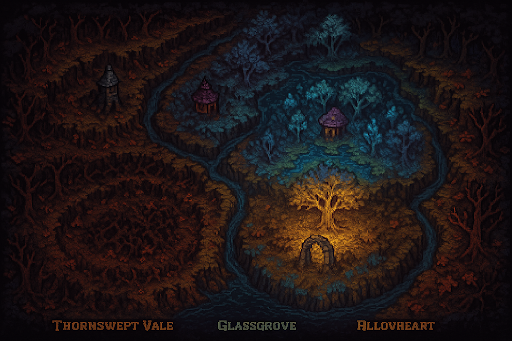
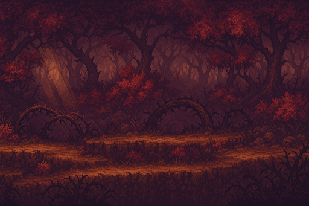
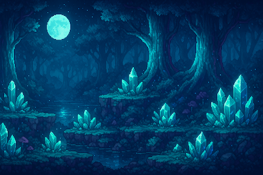
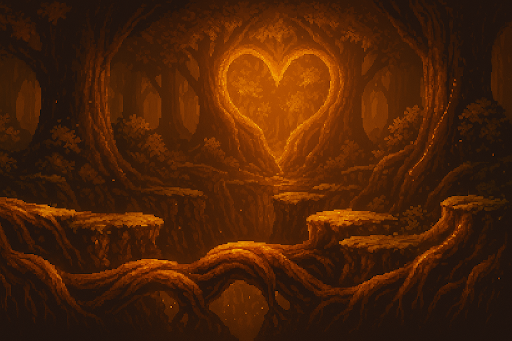
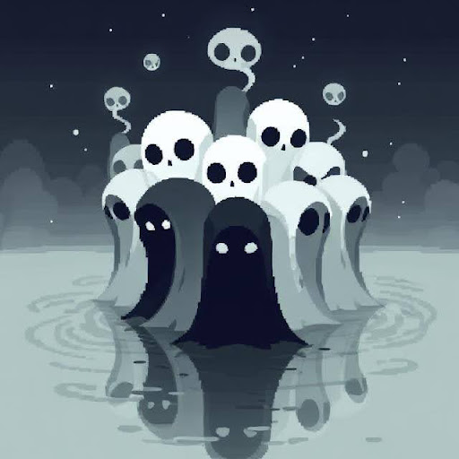

## Map of Eidwynd Hollow

Eidwynd Hollow is a vast, shifting woodland where reality bends. Sunlight breaks through twisted canopies in unnatural angles, rivers flow backward at dusk, and ancient ruins rise or vanish with the phases of the moon. 

The forest is divided into themed biomes—each with unique environmental puzzles, creatures, and hidden truths:

## The Thornswept Vale

STAGES 1 - 3

A section tangled in brambles and darkness. Glowing insects guide the path, but strange statues seem to turn their heads when you’re not looking

## Glassgrove 

STAGES 4 - 6

Trees with crystalline bark reflect possible futures. NPCs here speak in riddles, and monsters appear as distorted reflections of the player.

## Hollowheart

STAGES 7-9

The supposed "center" of the forest—though reaching it is near impossible. Time collapses here, and reality flickers like an old film reel.

## Final Ending

The True Ending:
Having explored through Thornswept Vale, Glassgrove and Hollowheart, the choir beckons the hero and reveals the truth. 

“You were a soldier once-one death among thousands. But grief remembered you. Regret shaped you. And from the silence between final breaths, something greater was born. You are not just one soul. You are the echo of all who never made it home”   

Source: <a href="https://github.com/jogarces/ics-313-text-game"><i class="large github icon "></i>jogarces/ics-313-text-game</a>
