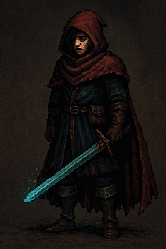
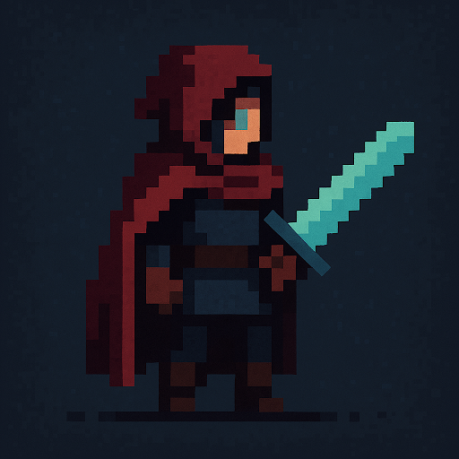
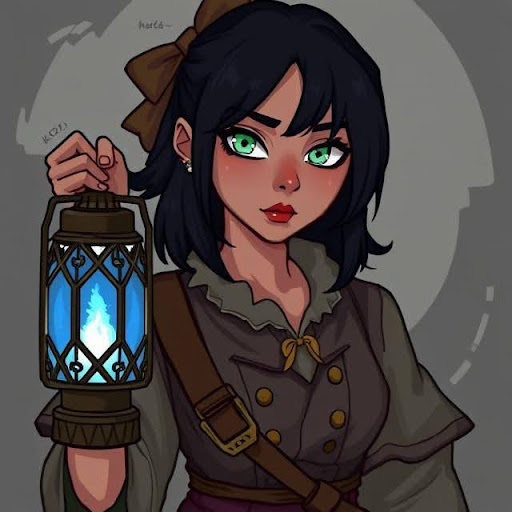
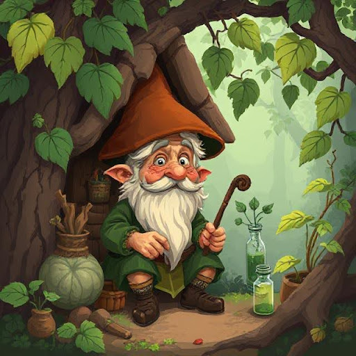
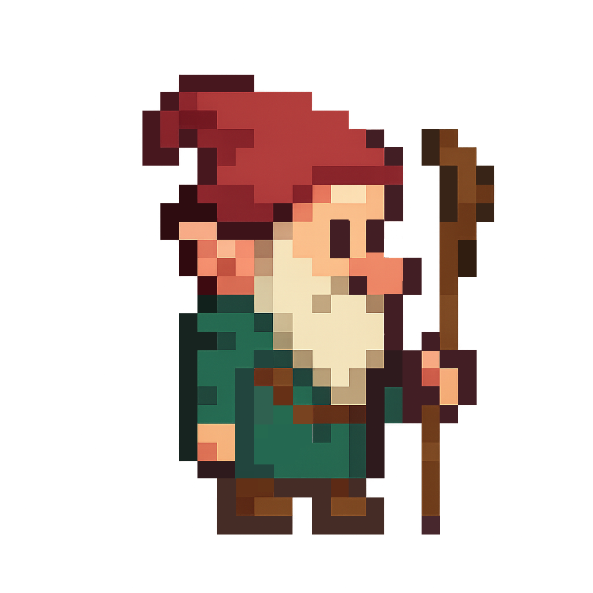
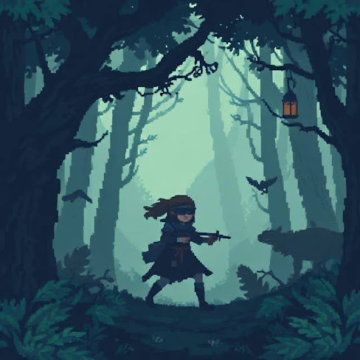
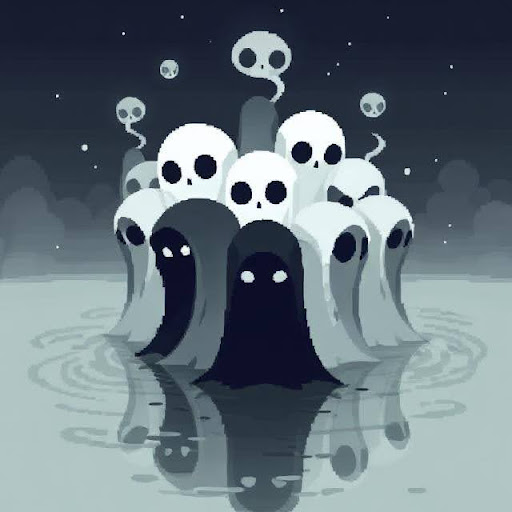

// Characters //

Main Character (Name: ???)
Intro:
The Main Character is a mysterious individual that appears to be unconscious within Eidwynd Hollow.

Attire:
Red Robe
Blue Garments
Brown Boots

Weapon:
Aelvantar (Mythical Blue Sword)

NPC ( Name: Ira the Lanternkeeper ) [Thornswept Vale]
Intro:
A former cartographer whose memory is fading with every sunrise. She offers cryptic maps and personal stories that suggest she’s lived many lifetimes in the forest.

Features:
Green Eyes
Red Lipstick

Attire:
Brown Bow
Earrings
Black and Green Attire
Brown Satchel

Weapon:
Blue Lantern

NPC ( Name: Sova ) [Glassgrove]
Intro:
An old gnome-like man who works as a herbalist within Glassgrove. He crafts memory potions from forest herbs. His hut is full of talking roots and animated leaves that argue with each other.

Features:
Old man wrinkles
White long beard
Bulb nose
Pointy droopy ears

Attire:
Red hat
Green Robe
Brown Boots

Weapon:
Wooden Staff

NPC ( Name: Thorne ) [Glassgrove]
Intro:
A monster hunter who insists the forest betrayed her. She hunts its creatures relentlessly, yet something about her presence warps the forest’s mood.

Features:
Brown Hair in a Ponytail
Natural 

Attire:
Black Blindfold over Her Eyes
Dark blue torn cap over her shoulders
Long black skirt
Grey stockings
Brown folded boots
Red rope tied around her waist

Weapon:
Crossbow

NPC ( Name: The Choir ) [Thornswept Vale / Glassgrove / Hollowheart]
Intro:
A collective of ghostly children who speak in unison. They only appear in reflections and water surfaces. Their connection to Eidwynd’s origins is profound—and dangerous.

Features:
Their ominous yet adorable and simplistic paranormal forms

Attire:
Shadows 

Weapon:
Their Songs
